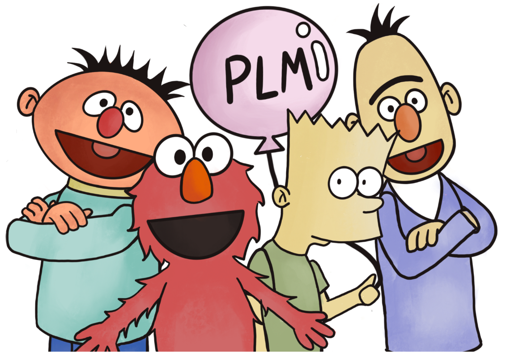

# Pre-trained Language Model, PLM

预训练语言模型用于在大规模语料库上生成通用语言表征，为下游任务引入先验知识(如语言结构等)。具体地说，PLM相当于一个编码器，可以将输入的文本编码为向量表征。

<!--more-->

## 表征分类

- 上下文无关的表征(Non-Contextual Representation): 为每个词生成静态表征，不受上下文的影响，无法解决多义词问题或 out of vocabulary 问题。只能通过减小表征粒度解决泛化性问题。如NNLM, word2vec, GloVe
- 上下文有关的表征(Contextual Representation): 每个词的表征会受到上下文的影响，每个词的表征向量都融合了上下文信息。

## 预训练目标

- Standard Language Model, (S)ML: 标准语言模型，通过训练来优化根据左侧文本预测下一个词的概率，是一种自回归模型。
- Noise Objective: 通过给输入文本添加噪声，然后计算模型去噪后的文本与原始文本之间的交叉熵。
  - Masked Language Model, MLM
  - Permulated Language Model, PLM
  - Denoising Autoencoder, DAE

## 微调/领域迁移

预训练模型的不同网络层捕捉不同的信息，如词性，语法，长期依赖，语义，指代等。观察发现基础的语法/句法信息被浅层的网络捕捉，高级的语义信息出现在深层的网络中。

因此根据任务的不同，可能需要选择不同层的信息并额外添加其他结构进行微调。如分类任务可能需要额外添加分类层。

# 早期的预训练语言模型

早期预训练语言模型一般使用RNN或CNN作为网络结构。如